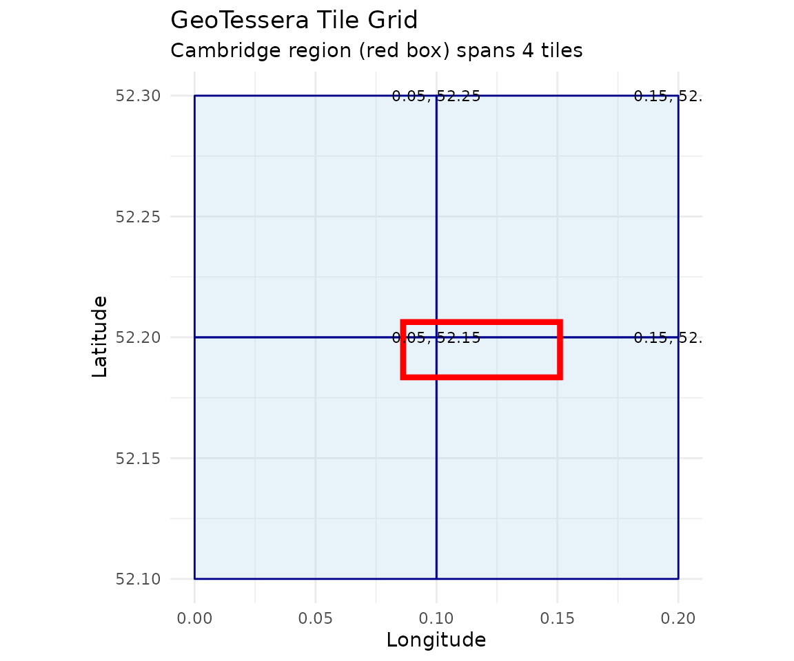
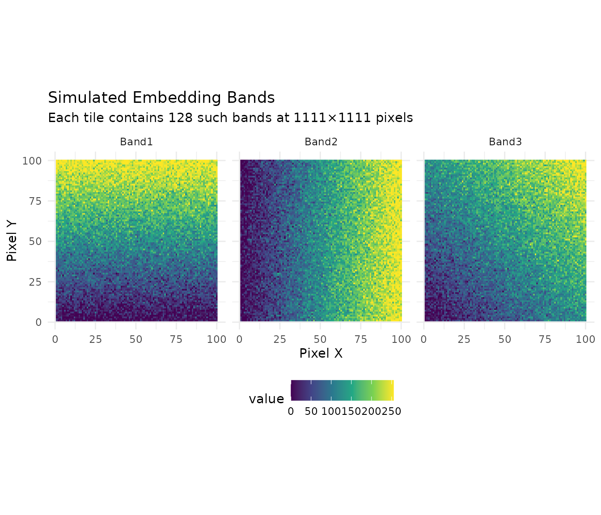
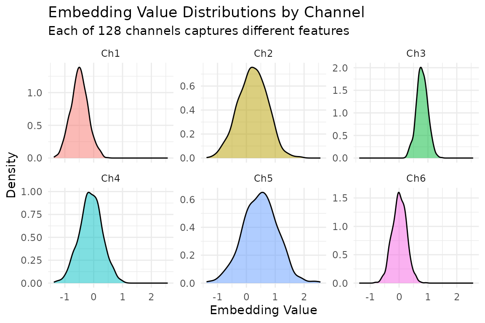

# Getting Started with GeoTessera

## Introduction

The **GeoTessera** package provides an R interface to Tessera
geofoundation model embeddings. Tessera is a foundation model that
processes Sentinel-1 and Sentinel-2 satellite imagery to generate
128-channel dense representation maps at 10m resolution.

These embeddings capture rich semantic information about land cover,
land use, and environmental conditions, making them useful for:

- Land cover classification
- Change detection
- Environmental monitoring
- Agricultural applications
- Urban analysis

## Installation

``` r
# Install from GitHub
remotes::install_github("lassa_sentinel/GeoTessera")

# Or install from local source
install.packages("path/to/GeoTessera", repos = NULL, type = "source")
```

``` r
library(GeoTessera)
```

## Coordinate System Demonstration

Before diving into downloads, let’s demonstrate how GeoTessera’s
coordinate system works. These examples run without network access.

### Tile Coordinate Conversion

GeoTessera tiles are 0.1° × 0.1° cells aligned to a global grid:

``` r
# Convert a world coordinate to its containing tile
tile_coords <- tile_from_world(lon = 0.17, lat = 52.23)
print(tile_coords)
#> $tile_lon
#> [1] 0.15
#> 
#> $tile_lat
#> [1] 52.25
# This point falls within tile (0.15, 52.25)

# Get the bounds of that tile
bounds <- tile_to_bounds(tile_coords$tile_lon, tile_coords$tile_lat)
print(bounds)
#> $xmin
#> [1] 0.1
#> 
#> $ymin
#> [1] 52.2
#> 
#> $xmax
#> [1] 0.2
#> 
#> $ymax
#> [1] 52.3
# The tile covers lon: [0.15, 0.25), lat: [52.2, 52.3)
```

### Visualizing the Tile Grid

``` r
library(ggplot2)

# Cambridge region bounding box
cambridge <- data.frame(
  xmin = 0.086174, ymin = 52.183432,
 xmax = 0.151062, ymax = 52.206318
)

# Calculate which tiles cover this region
tiles <- expand.grid(
  tile_lon = seq(0.05, 0.15, by = 0.1),
  tile_lat = seq(52.15, 52.25, by = 0.1)
)

# Create tile polygons
tile_polys <- do.call(rbind, lapply(1:nrow(tiles), function(i) {
  bounds <- tile_to_bounds(tiles$tile_lon[i], tiles$tile_lat[i])
  data.frame(
    tile = paste0("grid_", tiles$tile_lon[i], "_", tiles$tile_lat[i]),
    x = c(bounds$xmin, bounds$xmax, bounds$xmax, bounds$xmin, bounds$xmin),
    y = c(bounds$ymin, bounds$ymin, bounds$ymax, bounds$ymax, bounds$ymin)
  )
}))

# Plot the tile grid with Cambridge bbox
ggplot() +
  geom_polygon(data = tile_polys, aes(x = x, y = y, group = tile),
               fill = "lightblue", color = "darkblue", alpha = 0.3) +
  geom_rect(data = cambridge,
            aes(xmin = xmin, xmax = xmax, ymin = ymin, ymax = ymax),
            fill = NA, color = "red", linewidth = 1.5) +
  geom_text(data = tiles, aes(x = tile_lon + 0.05, y = tile_lat + 0.05,
            label = paste0(tile_lon, ", ", tile_lat)),
            size = 3) +
  coord_fixed() +
  labs(title = "GeoTessera Tile Grid",
       subtitle = "Cambridge region (red box) spans 4 tiles",
       x = "Longitude", y = "Latitude") +
  theme_minimal()
```



### Simulated Embedding Visualization

Here’s what a single tile’s embeddings look like when visualized:

``` r
# Create simulated embedding data (128 channels, 100x100 pixels for speed)
set.seed(42)
n_pixels <- 100
n_channels <- 128

# Simulate smooth spatial patterns using simple gradients + noise
x_grid <- matrix(rep(1:n_pixels, n_pixels), nrow = n_pixels, byrow = TRUE)
y_grid <- matrix(rep(1:n_pixels, n_pixels), nrow = n_pixels, byrow = FALSE)

# Create a 3-channel visualization (simulating first 3 embedding bands)
band1 <- (x_grid / n_pixels + rnorm(n_pixels^2, 0, 0.1)) * 255
band2 <- (y_grid / n_pixels + rnorm(n_pixels^2, 0, 0.1)) * 255
band3 <- ((x_grid + y_grid) / (2 * n_pixels) + rnorm(n_pixels^2, 0, 0.1)) * 255

# Clamp values
band1 <- pmax(0, pmin(255, band1))
band2 <- pmax(0, pmin(255, band2))
band3 <- pmax(0, pmin(255, band3))

# Create data frame for plotting
sim_data <- data.frame(
  x = rep(1:n_pixels, n_pixels),
  y = rep(1:n_pixels, each = n_pixels),
  Band1 = as.vector(band1),
  Band2 = as.vector(band2),
  Band3 = as.vector(band3)
)

# Reshape for faceted plot
library(tidyr)
sim_long <- pivot_longer(sim_data, cols = c(Band1, Band2, Band3),
                          names_to = "band", values_to = "value")

ggplot(sim_long, aes(x = x, y = y, fill = value)) +
  geom_raster() +
  facet_wrap(~band, ncol = 3) +
  scale_fill_viridis_c() +
  coord_fixed() +
  labs(title = "Simulated Embedding Bands",
       subtitle = "Each tile contains 128 such bands at 1111×1111 pixels",
       x = "Pixel X", y = "Pixel Y") +
  theme_minimal() +
  theme(legend.position = "bottom")
```



### Embedding Value Distribution

``` r
# Simulate what real embedding distributions look like
set.seed(123)
n_samples <- 1000

# Embeddings typically have structured distributions per channel
embedding_samples <- data.frame(
  Channel = rep(paste0("Ch", 1:6), each = n_samples),
  Value = c(
    rnorm(n_samples, mean = -0.5, sd = 0.3),
    rnorm(n_samples, mean = 0.2, sd = 0.5),
    rnorm(n_samples, mean = 0.8, sd = 0.2),
    rnorm(n_samples, mean = -0.1, sd = 0.4),
    rnorm(n_samples, mean = 0.5, sd = 0.6),
    rnorm(n_samples, mean = 0.0, sd = 0.25)
  )
)

ggplot(embedding_samples, aes(x = Value, fill = Channel)) +
  geom_density(alpha = 0.5) +
  facet_wrap(~Channel, scales = "free_y") +
  labs(title = "Embedding Value Distributions by Channel",
       subtitle = "Each of 128 channels captures different features",
       x = "Embedding Value", y = "Density") +
  theme_minimal() +
  theme(legend.position = "none")
```



## Understanding the Data Structure

Tessera data is organized hierarchically:

    World Coordinates (any lon/lat)
        |
    Blocks (5 x 5 degree regions) - for registry organization
        |
    Tiles (0.1 x 0.1 degree regions) - individual data files
        |
    Pixels (10m resolution) - 1111 x 1111 per tile
        |
    Embeddings (128 channels per pixel)

Each tile covers approximately 11 km x 11 km and contains about 1.2
million pixels, each with 128 embedding values.

## Creating a GeoTessera Client

The main entry point is the
[`geotessera()`](https://lassa-sentinel.github.io/GeoTessera/reference/GeoTessera.md)
function:

``` r
# Create a client with default settings
gt <- geotessera()

# Print information about the client
print(gt)
```

You can customize the client with various options:

``` r
gt <- geotessera(
  dataset_version = "v1",           # Dataset version
  cache_dir = "~/.cache/geotessera", # Where to cache registry files
  embeddings_dir = "./data",         # Where to store downloaded embeddings
  verify_hashes = TRUE               # Verify SHA256 hashes on downloads
)
```

## Quick Start: Cambridge Region Example

This section uses the Cambridge, UK region as a practical example. This
area contains 4 tiles (approximately 400 MB total) and is a good size
for getting started.

### Step 1: Initialize and Query

``` r
# Create client
gt <- geotessera()

# Cambridge region bounding box (covers 4 tiles)
cambridge_bbox <- c(0.086174, 52.183432, 0.151062, 52.206318)

# Check how many tiles are available
n_tiles <- gt$embeddings_count(
  bbox = list(
    xmin = cambridge_bbox[1],
    ymin = cambridge_bbox[2],
    xmax = cambridge_bbox[3],
    ymax = cambridge_bbox[4]
  ),
  year = 2024
)
print(paste("Tiles available:", n_tiles))
# Expected: 4 tiles
```

### Step 2: Get Tile Metadata

``` r
# Get tile metadata (doesn't download data yet)
tiles <- gt$get_tiles(
  bbox = list(
    xmin = cambridge_bbox[1],
    ymin = cambridge_bbox[2],
    xmax = cambridge_bbox[3],
    ymax = cambridge_bbox[4]
  ),
  year = 2024
)

# View tile information
print(tiles)
# Columns: lon, lat, year, embedding_hash, scales_hash, embedding_size, scales_size

# The 4 tiles should be:
# grid_0.05_52.15, grid_0.05_52.25, grid_0.15_52.15, grid_0.15_52.25
```

### Step 3: Download and Export as GeoTIFFs

``` r
# Export tiles as GeoTIFFs (downloads data and converts)
output_dir <- "cambridge_embeddings"
paths <- gt$export_embedding_geotiffs(
  tiles = tiles,
  output_dir = output_dir,
  compress = "lzw",
  progress = TRUE
)

# List exported files
print(paths)
```

### Step 4: Load and Inspect a Tile

``` r
# Download a single tile containing a specific point
tile <- gt$download_tile(
  lon = 0.1,      # A point within Cambridge
  lat = 52.2,
  year = 2024
)

# View tile information
print(tile)
print(tile$get_grid_name())   # "grid_0.05_52.15"
print(tile$get_bounds())      # xmin=0.0, ymin=52.1, xmax=0.1, ymax=52.2

# Load the embedding array
embedding <- tile$load_embedding()
print(dim(embedding))
# [1] 1111 1111  128 (height, width, channels)

# Access a specific pixel's embedding (center of tile)
pixel_embedding <- embedding[556, 556, ]
print(length(pixel_embedding))  # 128 values
```

### Step 5: Sample at Specific Points

``` r
# Define sample points within Cambridge
sample_points <- data.frame(
  lon = c(0.10, 0.12, 0.14),
  lat = c(52.19, 52.20, 52.21),
  site_name = c("West Cambridge", "Central", "East Cambridge")
)

# Sample embeddings at these points
samples <- gt$sample_embeddings_at_points(
  points = sample_points,
  year = 2024,
  download = TRUE,
  progress = TRUE
)

# View results
print(dim(samples))
# [1]   3 130 (3 points x (lon + lat + 128 embeddings))

print(names(samples)[1:10])
# "lon" "lat" "embedding_1" "embedding_2" ...
```

## Working with Different Regions

### UK Region (16 tiles)

A larger example covering London:

``` r
# UK region around London (16 tiles)
uk_bbox <- list(xmin = -0.1, ymin = 51.3, xmax = 0.1, ymax = 51.5)

# Check tile count
n_tiles <- gt$embeddings_count(bbox = uk_bbox, year = 2024)
print(paste("UK region tiles:", n_tiles))
# Expected: 16 tiles

# Get tile metadata (dry run - no download)
uk_tiles <- gt$get_tiles(bbox = uk_bbox, year = 2024)
print(nrow(uk_tiles))  # 16
```

### Single Tile from a Point

``` r
# Any point resolves to a specific tile
# Point (0.17, 52.23) -> tile grid_0.15_52.25
tile_coords <- tile_from_world(0.17, 52.23)
print(paste("Tile:", tile_coords$tile_lon, tile_coords$tile_lat))
# "Tile: 0.15 52.25"

# Download just that tile
single_tile <- gt$download_tile(lon = 0.17, lat = 52.23, year = 2024)
print(single_tile$get_grid_name())  # "grid_0.15_52.25"
```

## Exploring Available Data

``` r
# Check available years
years <- gt$registry$get_available_years()
print(years)
# [1] 2017 2018 2019 2020 2021 2022 2023 2024 2025

# Get tile counts by year
counts <- gt$registry$get_tile_counts_by_year()
print(counts)
```

## Different Bounding Box Formats

``` r
# As a named vector
bbox <- c(xmin = 0.086174, ymin = 52.183432, xmax = 0.151062, ymax = 52.206318)

# As a list
bbox <- list(xmin = 0.086174, ymin = 52.183432, xmax = 0.151062, ymax = 52.206318)

# From an sf object
library(sf)
cambridge <- st_point(c(0.12, 52.2)) |>
  st_sfc(crs = 4326) |>
  st_buffer(0.05)
bbox <- st_bbox(cambridge)

# All formats work with get_tiles()
tiles <- gt$get_tiles(bbox = bbox, year = 2024)
```

## Exporting Specific Bands

``` r
# Export only first 3 bands (useful for RGB visualization)
paths <- gt$export_embedding_geotiffs(
  tiles = tiles,
  output_dir = "cambridge_3bands",
  bands = 1:3,
  compress = "lzw"
)
```

## Working with terra

The exported GeoTIFFs work seamlessly with the `terra` package:

``` r
library(terra)

# Load an exported tile
r <- rast("cambridge_embeddings/grid_0.05_52.15.tif")

# Basic information
print(r)
print(nlyr(r))      # 128 layers
print(res(r))       # Resolution (in UTM meters)
print(ext(r))       # Extent (in UTM coordinates)
print(crs(r))       # CRS (UTM zone 31N for Cambridge)

# Extract specific bands
bands_subset <- r[[1:3]]

# Plot a single band
plot(r[[1]], main = "Band 1")

# Create RGB plot from bands 30, 60, 90
plotRGB(r[[c(30, 60, 90)]], stretch = "lin")

# Calculate statistics
global(r[[1]], fun = "mean", na.rm = TRUE)
```

## Applying PCA for Visualization

Reduce 128 bands to 3 principal components for visualization:

``` r
# Load embedding from a tile
tile <- gt$download_tile(lon = 0.1, lat = 52.2, year = 2024)
embedding <- tile$load_embedding()

# Apply PCA (128 -> 3 components)
pca_result <- gt$apply_pca_to_embeddings(
  embeddings = embedding,
  n_components = 3
)

print(dim(pca_result))
# [1] 1111 1111    3

# Export tiles with PCA applied
pca_paths <- gt$export_pca_geotiffs(
  tiles = tiles,
  output_dir = "cambridge_pca",
  n_components = 3
)
```

## Merging Tiles into Mosaics

Combine multiple tiles into a single raster:

``` r
# Merge all GeoTIFFs in a directory
gt$merge_geotiffs_to_mosaic(
  input_dir = "cambridge_embeddings",
  output_path = "cambridge_mosaic.tif"
)

# Or use terra directly for more control
library(terra)
tiffs <- list.files("cambridge_embeddings", pattern = "\\.tif$", full.names = TRUE)
rasters <- lapply(tiffs, rast)
mosaic <- do.call(merge, rasters)
writeRaster(mosaic, "cambridge_mosaic_terra.tif")
```

## Discovering Local Tiles

If you have previously downloaded tiles, you can discover them:

``` r
# Auto-detect tile format and find all tiles
tiles <- discover_tiles("cambridge_embeddings")
print(length(tiles))

# Get tiles by format
formats <- discover_formats("./data")
print(names(formats))  # "npy", "geotiff", "zarr"
print(length(formats$geotiff))
```

## Configuration Options

### Cache Directory

``` r
# Check default cache location
print(get_cache_dir())

# Set custom cache via environment variable
Sys.setenv(GEOTESSERA_CACHE_DIR = "/path/to/cache")

# Or pass directly to client
gt <- geotessera(cache_dir = "/custom/cache")
```

### Hash Verification

``` r
# Disable hash verification for faster downloads (not recommended for production)
gt <- geotessera(verify_hashes = FALSE)
```

## Best Practices

1.  **Start with Cambridge**: Use the Cambridge region (4 tiles, ~400
    MB) for testing.

2.  **Use compression**: Always use `compress = "lzw"` for GeoTIFF
    exports to save disk space (typically 50-70% reduction).

3.  **Work regionally**: Process data in chunks rather than loading
    entire countries at once.

4.  **Keep hash verification**: Leave `verify_hashes = TRUE` to ensure
    data integrity, especially for archival purposes.

5.  **Use point sampling**: For machine learning tasks, sample at points
    rather than downloading entire tiles when possible.

6.  **Monitor disk space**: Each tile is approximately 100 MB for NPY
    format. The Cambridge region is ~400 MB; the UK London region (16
    tiles) is ~1.6 GB.

## Troubleshooting

### Connection Issues

``` r
# Check if the registry is accessible
tryCatch({
  gt <- geotessera()
  years <- gt$registry$get_available_years()
  print(paste("Connection successful. Years:", paste(years, collapse = ", ")))
}, error = function(e) {
  print(paste("Connection failed:", e$message))
})
```

### Missing Tiles

``` r
# Some regions may not have coverage
bbox <- list(xmin = -180, ymin = -90, xmax = -170, ymax = -80)  # Antarctica
tiles <- gt$get_tiles(bbox = bbox, year = 2024)
if (nrow(tiles) == 0) {
  message("No tiles available for this region")
}
```

## Next Steps

- See
  [`vignette("machine-learning", package = "GeoTessera")`](https://lassa-sentinel.github.io/GeoTessera/articles/machine-learning.md)
  for ML workflows
- Explore the [Tessera documentation](https://geotessera.org) for more
  details
- Check the package reference:
  [`help(package = "GeoTessera")`](https://rdrr.io/pkg/GeoTessera/man)
