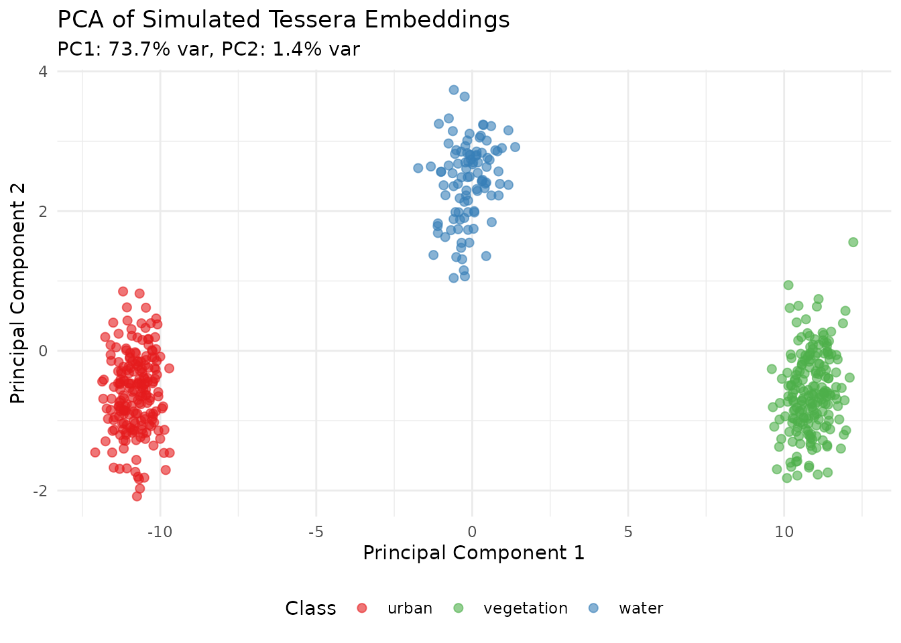
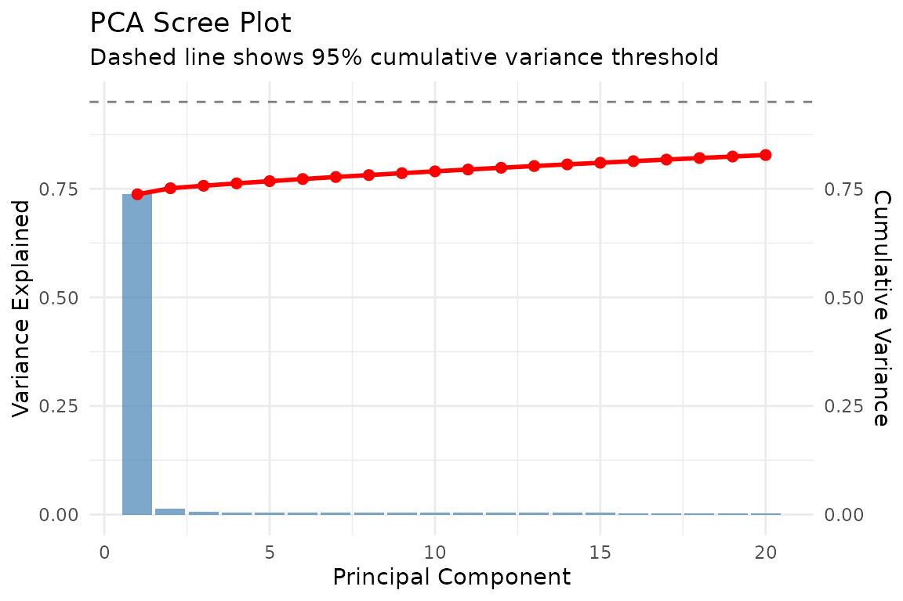
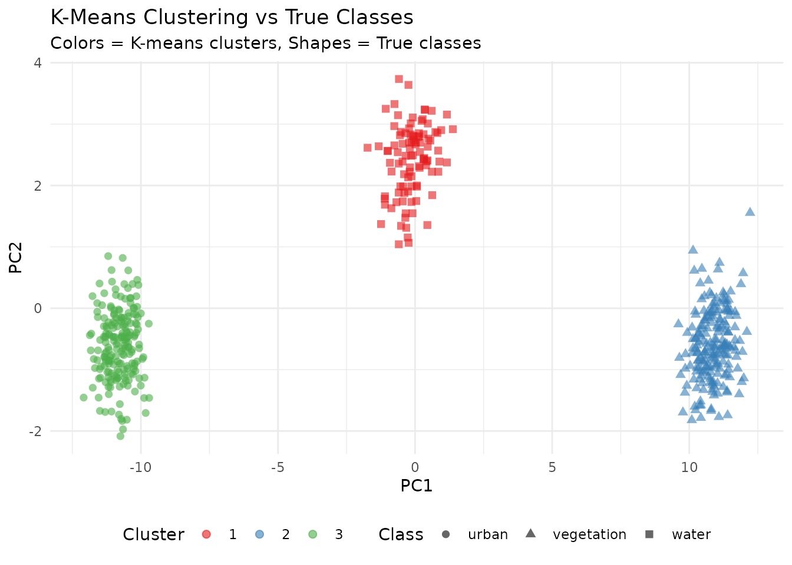
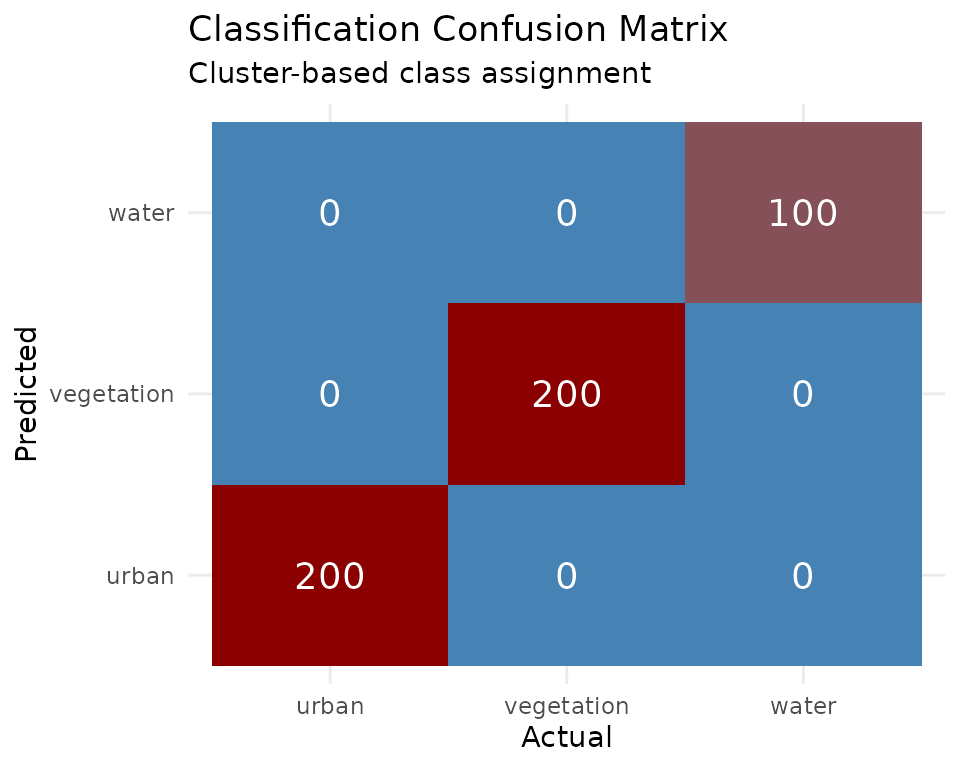
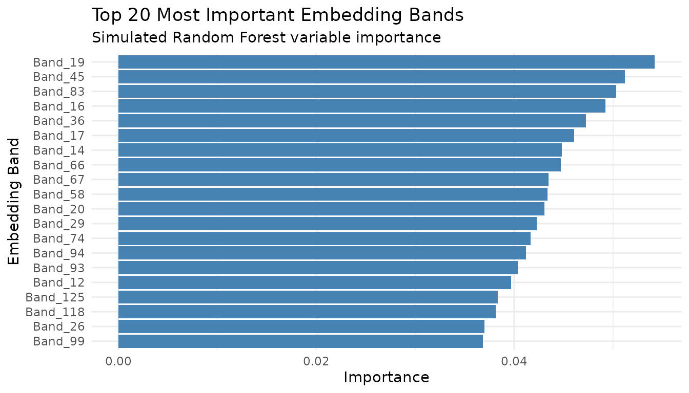

# Machine Learning with Tessera Embeddings

## Introduction

Tessera embeddings are designed to be used as features for machine
learning tasks. The 128-dimensional embedding vectors capture rich
semantic information about land cover, vegetation, urban areas, and
other environmental features derived from Sentinel-1 and Sentinel-2
satellite imagery.

This vignette demonstrates common machine learning workflows using the
Cambridge region (4 tiles, ~400 MB) as a practical example.

``` r
library(GeoTessera)
library(ggplot2)
```

## Demonstration with Simulated Data

Before working with real data, let’s demonstrate the machine learning
workflows using simulated embeddings. This helps understand the
structure without requiring downloads.

### Simulated 128-Channel Embeddings

``` r
set.seed(42)
n_samples <- 500

# Simulate 128-dimensional embeddings with 3 land cover types
# Each class has distinct patterns in embedding space
generate_class_embeddings <- function(n, class_id) {
  # Base pattern varies by class
  base <- switch(class_id,
    "urban" = rnorm(128, mean = 0.5, sd = 0.1),
    "vegetation" = rnorm(128, mean = -0.3, sd = 0.15),
    "water" = rnorm(128, mean = 0.1, sd = 0.05)
  )

  # Generate samples with class-specific variation
  samples <- matrix(nrow = n, ncol = 128)
  for (i in 1:n) {
    samples[i, ] <- base + rnorm(128, sd = 0.2)
  }
  samples
}

# Generate data for each class
urban_emb <- generate_class_embeddings(200, "urban")
veg_emb <- generate_class_embeddings(200, "vegetation")
water_emb <- generate_class_embeddings(100, "water")

# Combine into training data
X <- rbind(urban_emb, veg_emb, water_emb)
y <- factor(c(rep("urban", 200), rep("vegetation", 200), rep("water", 100)))

cat("Training data dimensions:", dim(X), "\n")
#> Training data dimensions: 500 128
cat("Class distribution:\n")
#> Class distribution:
print(table(y))
#> y
#>      urban vegetation      water 
#>        200        200        100
```

### PCA Visualization of Embeddings

``` r
# Apply PCA to visualize the 128-dimensional embeddings
pca_result <- prcomp(X, center = TRUE, scale. = TRUE)

# Variance explained
var_explained <- pca_result$sdev^2 / sum(pca_result$sdev^2)

# Create visualization data
pca_df <- data.frame(
  PC1 = pca_result$x[, 1],
  PC2 = pca_result$x[, 2],
  PC3 = pca_result$x[, 3],
  Class = y
)

# Plot PC1 vs PC2
ggplot(pca_df, aes(x = PC1, y = PC2, color = Class)) +
  geom_point(alpha = 0.6, size = 2) +
  scale_color_manual(values = c("urban" = "#E41A1C",
                                 "vegetation" = "#4DAF4A",
                                 "water" = "#377EB8")) +
  labs(title = "PCA of Simulated Tessera Embeddings",
       subtitle = sprintf("PC1: %.1f%% var, PC2: %.1f%% var",
                         var_explained[1]*100, var_explained[2]*100),
       x = "Principal Component 1",
       y = "Principal Component 2") +
  theme_minimal() +
  theme(legend.position = "bottom")
```



### Scree Plot

``` r
scree_df <- data.frame(
  PC = 1:20,
  Variance = var_explained[1:20],
  Cumulative = cumsum(var_explained[1:20])
)

ggplot(scree_df, aes(x = PC)) +
  geom_bar(aes(y = Variance), stat = "identity", fill = "steelblue", alpha = 0.7) +
  geom_line(aes(y = Cumulative), color = "red", linewidth = 1) +
  geom_point(aes(y = Cumulative), color = "red", size = 2) +
  geom_hline(yintercept = 0.95, linetype = "dashed", color = "gray50") +
  scale_y_continuous(
    name = "Variance Explained",
    sec.axis = sec_axis(~., name = "Cumulative Variance")
  ) +
  labs(title = "PCA Scree Plot",
       subtitle = "Dashed line shows 95% cumulative variance threshold",
       x = "Principal Component") +
  theme_minimal()
```



### K-Means Clustering

``` r
# K-means clustering (unsupervised)
set.seed(123)
kmeans_result <- kmeans(X, centers = 3, nstart = 25)

pca_df$Cluster <- factor(kmeans_result$cluster)

# Compare clusters to actual classes
ggplot(pca_df, aes(x = PC1, y = PC2)) +
  geom_point(aes(color = Cluster, shape = Class), alpha = 0.6, size = 2) +
  scale_color_brewer(palette = "Set1") +
  labs(title = "K-Means Clustering vs True Classes",
       subtitle = "Colors = K-means clusters, Shapes = True classes",
       x = "PC1", y = "PC2") +
  theme_minimal() +
  theme(legend.position = "bottom")
```



### Classification Confusion Matrix

``` r
# Simple classification assessment using cluster assignment
# Map clusters to most common class
cluster_class_map <- sapply(1:3, function(k) {
  names(which.max(table(y[kmeans_result$cluster == k])))
})

predicted <- factor(cluster_class_map[kmeans_result$cluster], levels = levels(y))
conf_matrix <- table(Predicted = predicted, Actual = y)

# Convert to data frame for plotting
conf_df <- as.data.frame(conf_matrix)

ggplot(conf_df, aes(x = Actual, y = Predicted, fill = Freq)) +
  geom_tile() +
  geom_text(aes(label = Freq), color = "white", size = 5) +
  scale_fill_gradient(low = "steelblue", high = "darkred") +
  labs(title = "Classification Confusion Matrix",
       subtitle = "Cluster-based class assignment") +
  theme_minimal() +
  theme(legend.position = "none")
```



### Feature Importance (Simulated)

``` r
# Simulate feature importance (as would come from Random Forest)
set.seed(456)
importance_df <- data.frame(
  Band = paste0("Band_", 1:128),
  Importance = abs(rnorm(128, mean = 0.02, sd = 0.015))
)
importance_df <- importance_df[order(-importance_df$Importance), ]
importance_df$Rank <- 1:128

# Plot top 20
ggplot(importance_df[1:20, ], aes(x = reorder(Band, Importance), y = Importance)) +
  geom_bar(stat = "identity", fill = "steelblue") +
  coord_flip() +
  labs(title = "Top 20 Most Important Embedding Bands",
       subtitle = "Simulated Random Forest variable importance",
       x = "Embedding Band", y = "Importance") +
  theme_minimal()
```



## Download Cambridge Region Data

First, let’s download the Cambridge region embeddings which we’ll use
throughout this vignette.

``` r
# Create client
gt <- geotessera()

# Cambridge region bounding box (4 tiles)
cambridge_bbox <- list(
  xmin = 0.086174,
  ymin = 52.183432,
  xmax = 0.151062,
  ymax = 52.206318
)

# Get tile metadata
tiles <- gt$get_tiles(bbox = cambridge_bbox, year = 2024)
print(paste("Tiles:", nrow(tiles)))
# Expected: 4 tiles

# Export as GeoTIFFs
output_dir <- "cambridge_tiles"
paths <- gt$export_embedding_geotiffs(
  tiles = tiles,
  output_dir = output_dir,
  compress = "lzw",
  progress = TRUE
)

# Discover and load tiles
tile_list <- discover_tiles(output_dir, format = "geotiff")
print(paste("Loaded tiles:", length(tile_list)))
```

## Land Cover Classification

A common use case is classifying land cover types using labeled training
data.

### Preparing Training Data with Real Embeddings

``` r
# Sample training locations across Cambridge
# These represent different land cover types in the region
training_sites <- data.frame(
  lon = c(
    0.10, 0.11, 0.095, 0.12, 0.105,  # Urban/built-up
    0.09, 0.14, 0.135, 0.088, 0.13,  # Green spaces/parks
    0.115, 0.125                      # Water/wetland
  ),
  lat = c(
    52.19, 52.195, 52.188, 52.20, 52.192,  # Urban
    52.185, 52.20, 52.195, 52.19, 52.185,  # Green
    52.205, 52.198                          # Water
  ),
  land_cover = c(
    rep("urban", 5),
    rep("green", 5),
    rep("water", 2)
  )
)

# Sample embeddings at training locations
training_embeddings <- gt$sample_embeddings_at_points(
  points = training_sites,
  year = 2024,
  download = TRUE
)

# Combine with labels
X_train <- as.matrix(training_embeddings[, 3:130])  # embedding_1 to embedding_128
y_train <- as.factor(training_sites$land_cover)

print(dim(X_train))
# [1] 12 128

print(table(y_train))
#  green urban water
#      5     5     2
```

### Training a Random Forest Classifier

``` r
library(randomForest)

# Train random forest
set.seed(42)
rf_model <- randomForest(
  x = X_train,
  y = y_train,
  ntree = 500,
  importance = TRUE
)

print(rf_model)

# Variable importance - which embedding bands are most predictive?
importance_df <- as.data.frame(importance(rf_model))
importance_df$band <- rownames(importance_df)
importance_df <- importance_df[order(-importance_df$MeanDecreaseAccuracy), ]
print(head(importance_df, 20))
```

### Predicting on New Locations

``` r
# Sample embeddings at new locations within Cambridge
new_sites <- data.frame(
  lon = c(0.09, 0.11, 0.13, 0.10),
  lat = c(52.19, 52.20, 52.185, 52.195)
)

new_embeddings <- gt$sample_embeddings_at_points(
  points = new_sites,
  year = 2024
)

X_new <- as.matrix(new_embeddings[, 3:130])

# Make predictions
predictions <- predict(rf_model, X_new)
probabilities <- predict(rf_model, X_new, type = "prob")

results <- cbind(new_sites, prediction = predictions, probabilities)
print(results)
```

### Classifying an Entire Tile

``` r
# Load a Cambridge tile
tile <- gt$download_tile(lon = 0.1, lat = 52.2, year = 2024)

# Load embedding as array
embedding <- tile$load_embedding()
dims <- dim(embedding)  # (1111, 1111, 128)

# Reshape to 2D matrix for prediction
embedding_2d <- matrix(embedding, nrow = dims[1] * dims[2], ncol = dims[3])

# Predict (1.2M pixels)
pixel_predictions <- predict(rf_model, embedding_2d)

# Reshape back to image
classified <- matrix(
  as.integer(pixel_predictions),
  nrow = dims[1],
  ncol = dims[2]
)

# Create raster
bounds <- tile$get_bounds()
r_classified <- rast(
  nrows = dims[1],
  ncols = dims[2],
  xmin = bounds$xmin,
  xmax = bounds$xmax,
  ymin = bounds$ymin,
  ymax = bounds$ymax,
  crs = "EPSG:4326"
)
values(r_classified) <- as.vector(t(classified))

# Save result
writeRaster(r_classified, "cambridge_land_cover.tif", overwrite = TRUE)

# Plot
plot(r_classified, main = "Land Cover Classification - Cambridge")
```

## Clustering Analysis

Use unsupervised learning to discover natural groupings in Cambridge
embeddings.

### K-Means Clustering

``` r
# Sample random points across Cambridge region
set.seed(123)
n_samples <- 2000

random_points <- data.frame(
  lon = runif(n_samples, cambridge_bbox$xmin, cambridge_bbox$xmax),
  lat = runif(n_samples, cambridge_bbox$ymin, cambridge_bbox$ymax)
)

# Get embeddings
embeddings <- gt$sample_embeddings_at_points(random_points, year = 2024)
X <- as.matrix(embeddings[, 3:130])

# Remove any NA rows
valid_rows <- complete.cases(X)
X_valid <- X[valid_rows, ]
points_valid <- random_points[valid_rows, ]

print(paste("Valid samples:", nrow(X_valid)))

# K-means clustering
set.seed(42)
k <- 5
kmeans_result <- kmeans(X_valid, centers = k, nstart = 25, iter.max = 100)

# Add cluster assignments
points_valid$cluster <- as.factor(kmeans_result$cluster)

# Visualize
library(ggplot2)
ggplot(points_valid, aes(x = lon, y = lat, color = cluster)) +
  geom_point(size = 1, alpha = 0.7) +
  coord_fixed() +
  theme_minimal() +
  labs(
    title = "K-Means Clustering of Cambridge Embeddings",
    subtitle = paste("k =", k, "clusters,", nrow(points_valid), "samples")
  )
```

### Hierarchical Clustering

``` r
# Use subset for hierarchical clustering (memory intensive)
set.seed(42)
subset_idx <- sample(nrow(X_valid), min(500, nrow(X_valid)))
X_subset <- X_valid[subset_idx, ]

# Compute distance matrix
dist_matrix <- dist(X_subset)

# Hierarchical clustering
hc <- hclust(dist_matrix, method = "ward.D2")

# Plot dendrogram
plot(hc, labels = FALSE, main = "Hierarchical Clustering - Cambridge Embeddings")

# Cut tree at desired number of clusters
clusters <- cutree(hc, k = 5)
```

## Dimensionality Reduction

### PCA for Visualization

``` r
# Apply PCA to Cambridge embeddings
pca_result <- prcomp(X_valid, center = TRUE, scale. = TRUE)

# Variance explained
var_explained <- pca_result$sdev^2 / sum(pca_result$sdev^2)
cumvar <- cumsum(var_explained)

# How many components for 95% variance?
n_95 <- which(cumvar >= 0.95)[1]
print(paste("Components for 95% variance:", n_95))

# Plot variance explained
plot(var_explained[1:50], type = "b",
     xlab = "Principal Component", ylab = "Variance Explained",
     main = "PCA Scree Plot - Cambridge Embeddings")

# Visualize first two PCs with cluster coloring
pca_df <- data.frame(
  PC1 = pca_result$x[, 1],
  PC2 = pca_result$x[, 2],
  cluster = points_valid$cluster
)

ggplot(pca_df, aes(x = PC1, y = PC2, color = cluster)) +
  geom_point(alpha = 0.5, size = 0.5) +
  theme_minimal() +
  labs(title = "PCA of Cambridge Embeddings")
```

### Built-in PCA Export

``` r
# Export tiles with PCA reduction applied
pca_paths <- gt$export_pca_geotiffs(
  tiles = tiles,
  output_dir = "cambridge_pca",
  n_components = 3,
  progress = TRUE
)

# Load and visualize
library(terra)
r_pca <- rast(pca_paths[1])
plotRGB(r_pca, stretch = "lin", main = "PCA RGB Composite")
```

### UMAP for Nonlinear Visualization

``` r
library(uwot)

# UMAP embedding
set.seed(42)
umap_result <- umap(
  X_valid,
  n_neighbors = 15,
  min_dist = 0.1,
  n_components = 2,
  metric = "euclidean"
)

# Visualize
umap_df <- data.frame(
  UMAP1 = umap_result[, 1],
  UMAP2 = umap_result[, 2],
  cluster = points_valid$cluster
)

ggplot(umap_df, aes(x = UMAP1, y = UMAP2, color = cluster)) +
  geom_point(alpha = 0.5, size = 0.5) +
  theme_minimal() +
  labs(title = "UMAP Projection of Cambridge Embeddings")
```

## Change Detection

Compare embeddings from different years to detect changes in Cambridge.

### Temporal Difference Analysis

``` r
# Sample locations for change analysis
analysis_points <- data.frame(
  lon = seq(cambridge_bbox$xmin, cambridge_bbox$xmax, length.out = 100),
  lat = rep(52.195, 100)
)

# Get embeddings for two different years
embeddings_2020 <- gt$sample_embeddings_at_points(analysis_points, year = 2020)
embeddings_2024 <- gt$sample_embeddings_at_points(analysis_points, year = 2024)

# Calculate change magnitude (Euclidean distance in embedding space)
X_2020 <- as.matrix(embeddings_2020[, 3:130])
X_2024 <- as.matrix(embeddings_2024[, 3:130])

change_magnitude <- sqrt(rowSums((X_2024 - X_2020)^2))

# Create results
change_df <- data.frame(
  lon = analysis_points$lon,
  lat = analysis_points$lat,
  change = change_magnitude
)

# Visualize
ggplot(change_df, aes(x = lon, y = change)) +
  geom_line() +
  geom_point(aes(color = change)) +
  scale_color_viridis_c() +
  theme_minimal() +
  labs(
    title = "Embedding Change Magnitude (2020-2024)",
    subtitle = "Cambridge transect",
    x = "Longitude",
    y = "Change Magnitude (Euclidean distance)"
  )
```

### Change Maps

``` r
# Download tiles for two years
tile_2020 <- gt$download_tile(lon = 0.1, lat = 52.2, year = 2020)
tile_2024 <- gt$download_tile(lon = 0.1, lat = 52.2, year = 2024)

# Load embeddings
emb_2020 <- tile_2020$load_embedding()
emb_2024 <- tile_2024$load_embedding()

# Calculate per-pixel change magnitude
change_array <- sqrt(rowSums((emb_2024 - emb_2020)^2, dims = 2))

# Create raster
bounds <- tile_2020$get_bounds()
r_change <- rast(
  nrows = dim(change_array)[1],
  ncols = dim(change_array)[2],
  xmin = bounds$xmin,
  xmax = bounds$xmax,
  ymin = bounds$ymin,
  ymax = bounds$ymax,
  crs = "EPSG:4326"
)
values(r_change) <- as.vector(t(change_array))

# Plot
plot(r_change, main = "Change Detection 2020-2024 - Cambridge",
     col = hcl.colors(50, "YlOrRd", rev = TRUE))
```

## Regression Tasks

Predict continuous variables using Cambridge embeddings.

### Gradient Boosting Regression

``` r
library(xgboost)

# Example: Predict a continuous variable from embeddings
# (Using simulated target for demonstration - replace with real data)
training_with_target <- data.frame(
  lon = c(0.10, 0.095, 0.11, 0.12, 0.085, 0.13, 0.09, 0.115),
  lat = c(52.19, 52.185, 52.20, 52.195, 52.188, 52.19, 52.20, 52.192),
  target_value = c(120, 85, 150, 140, 90, 110, 95, 135)
)

# Get embeddings
train_emb <- gt$sample_embeddings_at_points(training_with_target, year = 2024)
X <- as.matrix(train_emb[, 3:130])
y <- training_with_target$target_value

# Train XGBoost
dtrain <- xgb.DMatrix(data = X, label = y)
params <- list(
  objective = "reg:squarederror",
  eta = 0.1,
  max_depth = 4
)

xgb_model <- xgb.train(
  params = params,
  data = dtrain,
  nrounds = 50,
  verbose = 0
)

# Feature importance
importance <- xgb.importance(model = xgb_model)
xgb.plot.importance(importance[1:20, ], main = "Top 20 Important Embedding Bands")

# Predict on new data
new_points <- data.frame(lon = c(0.1, 0.12), lat = c(52.19, 52.20))
new_embeddings <- gt$sample_embeddings_at_points(new_points, year = 2024)
X_new <- as.matrix(new_embeddings[, 3:130])
predictions <- predict(xgb_model, X_new)
print(paste("Predictions:", paste(round(predictions, 1), collapse = ", ")))
```

## Deep Learning with torch

Use Cambridge embeddings with deep learning frameworks.

### Preparing Data for torch

``` r
library(torch)

# Convert embeddings to torch tensors
X_tensor <- torch_tensor(X_valid, dtype = torch_float())
y_tensor <- torch_tensor(as.integer(points_valid$cluster), dtype = torch_long())

# Create dataset
dataset <- tensor_dataset(X_tensor, y_tensor)

# Create dataloader
dataloader <- dataloader(dataset, batch_size = 32, shuffle = TRUE)
```

### Simple Neural Network Classifier

``` r
# Define model
net <- nn_module(
  "EmbeddingClassifier",
  initialize = function(input_size = 128, hidden_size = 64, num_classes = 5) {
    self$fc1 <- nn_linear(input_size, hidden_size)
    self$relu <- nn_relu()
    self$dropout <- nn_dropout(p = 0.3)
    self$fc2 <- nn_linear(hidden_size, hidden_size %/% 2)
    self$fc3 <- nn_linear(hidden_size %/% 2, num_classes)
  },
  forward = function(x) {
    x %>%
      self$fc1() %>%
      self$relu() %>%
      self$dropout() %>%
      self$fc2() %>%
      self$relu() %>%
      self$dropout() %>%
      self$fc3()
  }
)

# Instantiate model
model <- net(input_size = 128, hidden_size = 64, num_classes = k)

# Training setup
optimizer <- optim_adam(model$parameters, lr = 0.001)
loss_fn <- nn_cross_entropy_loss()

# Training loop
epochs <- 10
for (epoch in 1:epochs) {
  model$train()
  total_loss <- 0
  n_batches <- 0

  coro::loop(for (batch in dataloader) {
    optimizer$zero_grad()
    output <- model(batch[[1]])
    loss <- loss_fn(output, batch[[2]])
    loss$backward()
    optimizer$step()
    total_loss <- total_loss + loss$item()
    n_batches <- n_batches + 1
  })

  cat(sprintf("Epoch %d, Avg Loss: %.4f\n", epoch, total_loss / n_batches))
}
```

## Working with All Cambridge Tiles

Process all 4 Cambridge tiles systematically.

### Batch Processing

``` r
# Process each tile
results <- list()

for (i in seq_len(nrow(tiles))) {
  tile_info <- tiles[i, ]

  # Download tile
  tile <- gt$download_tile(
    lon = tile_info$lon,
    lat = tile_info$lat,
    year = tile_info$year,
    progress = FALSE
  )

  # Load embedding
  embedding <- tile$load_embedding()

  # Calculate summary statistics per tile
  results[[i]] <- data.frame(
    grid_name = tile$get_grid_name(),
    lon = tile_info$lon,
    lat = tile_info$lat,
    mean_emb = mean(embedding, na.rm = TRUE),
    sd_emb = sd(embedding, na.rm = TRUE),
    min_emb = min(embedding, na.rm = TRUE),
    max_emb = max(embedding, na.rm = TRUE)
  )

  cat(sprintf("Processed tile %d/%d: %s\n", i, nrow(tiles), tile$get_grid_name()))
}

# Combine results
summary_df <- do.call(rbind, results)
print(summary_df)
```

### Parallel Processing

``` r
library(parallel)
library(foreach)
library(doParallel)

# Set up parallel backend
n_cores <- min(detectCores() - 1, nrow(tiles))
cl <- makeCluster(n_cores)
registerDoParallel(cl)

# Process tiles in parallel
results <- foreach(
  i = 1:nrow(tiles),
  .packages = c("GeoTessera", "terra"),
  .combine = rbind
) %dopar% {
  gt_local <- geotessera()
  tile_info <- tiles[i, ]

  tile <- gt_local$download_tile(
    lon = tile_info$lon,
    lat = tile_info$lat,
    year = tile_info$year,
    progress = FALSE
  )

  embedding <- tile$load_embedding()

  data.frame(
    grid_name = tile$get_grid_name(),
    mean_emb = mean(embedding, na.rm = TRUE),
    sd_emb = sd(embedding, na.rm = TRUE)
  )
}

stopCluster(cl)
print(results)
```

## Model Persistence

Save and load trained models for reuse.

``` r
# Save random forest model
saveRDS(rf_model, "cambridge_rf_model.rds")

# Load model
rf_model_loaded <- readRDS("cambridge_rf_model.rds")

# Save XGBoost model
xgb.save(xgb_model, "cambridge_xgb.model")

# Load XGBoost model
xgb_loaded <- xgb.load("cambridge_xgb.model")

# Save torch model
torch_save(model, "cambridge_classifier.pt")

# Load torch model
model_loaded <- torch_load("cambridge_classifier.pt")
```

## Best Practices for ML with Tessera Embeddings

1.  **Start with Cambridge**: The 4-tile Cambridge region (~400 MB) is
    ideal for prototyping and testing ML workflows.

2.  **Normalize if needed**: While embeddings are pre-scaled, additional
    normalization (z-score) may improve some models.

3.  **Spatial cross-validation**: Nearby points are correlated. Use
    spatial cross-validation (e.g., leave-one-tile-out) for reliable
    evaluation.

4.  **Feature selection**: Not all 128 bands may be relevant. Use
    importance scores to identify predictive bands.

5.  **Balance classes**: For classification, ensure balanced class
    representation or use class weights.

6.  **Multi-year features**: When available, combining embeddings from
    multiple years can capture temporal patterns.

7.  **Validate spatially**: Test models on separate geographic regions
    to ensure generalization.

## Summary of Cambridge Data Used

| Region    | Bounding Box                               | Tiles | Size    |
|-----------|--------------------------------------------|-------|---------|
| Cambridge | (0.086174, 52.183432, 0.151062, 52.206318) | 4     | ~400 MB |

Tiles in this region: - `grid_0.05_52.15` - `grid_0.05_52.25` -
`grid_0.15_52.15` - `grid_0.15_52.25`

## Next Steps

- Explore larger regions (e.g., UK London: 16 tiles, ~1.6 GB)
- Combine embeddings with auxiliary data (elevation, climate, etc.)
- Implement active learning to efficiently label training data
- Use ensemble methods to combine multiple models
